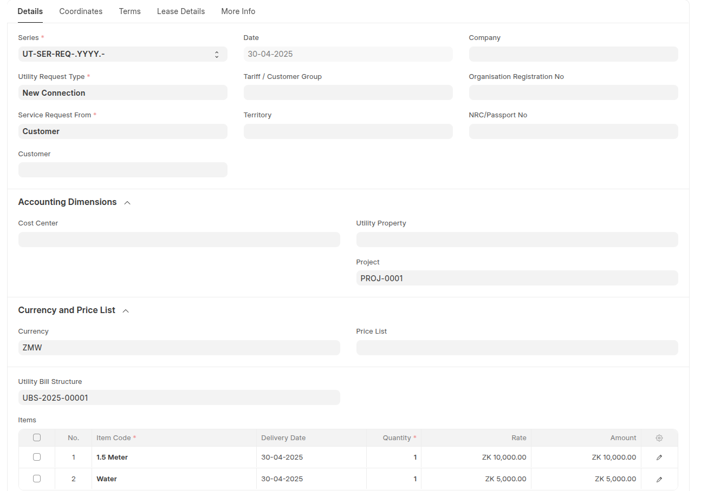
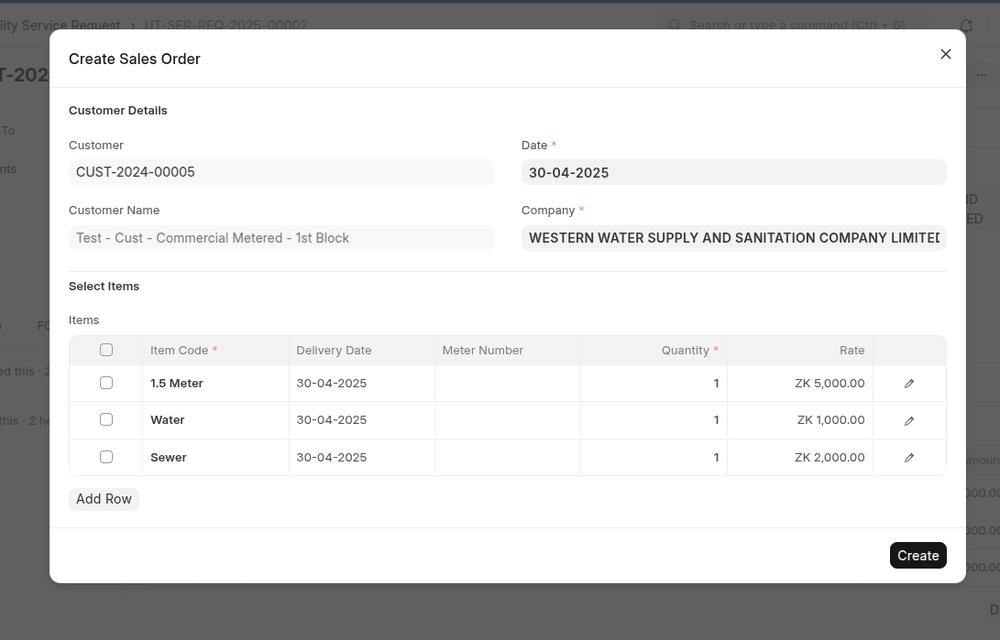
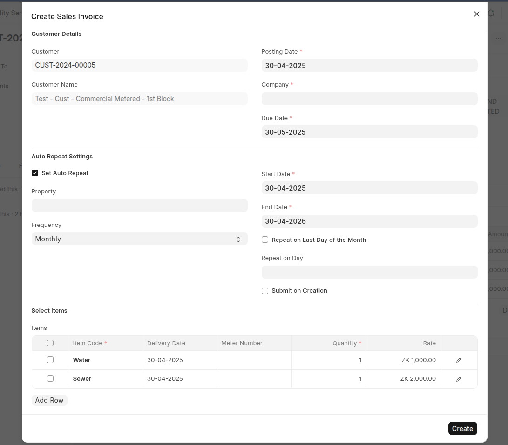
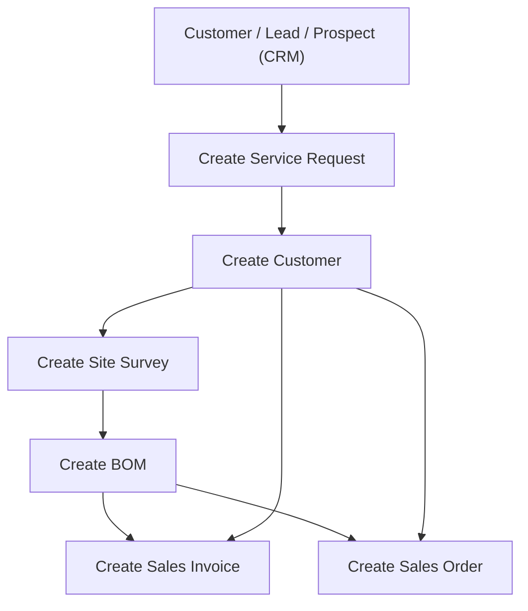
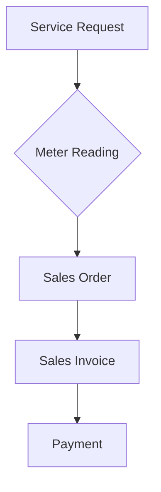
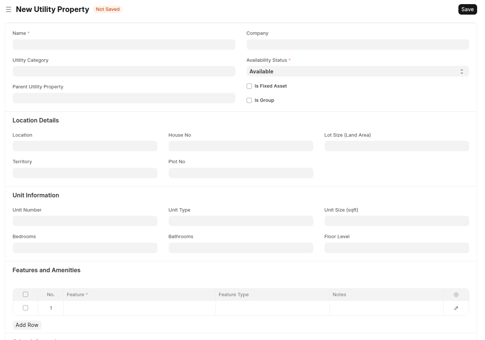
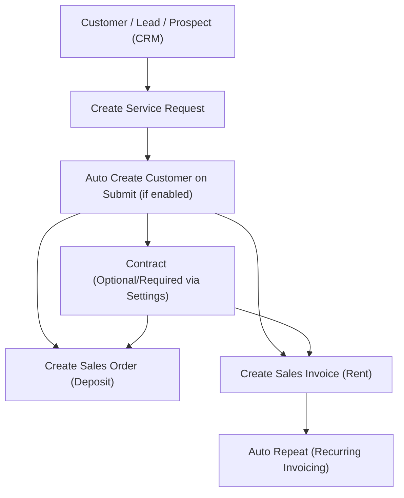
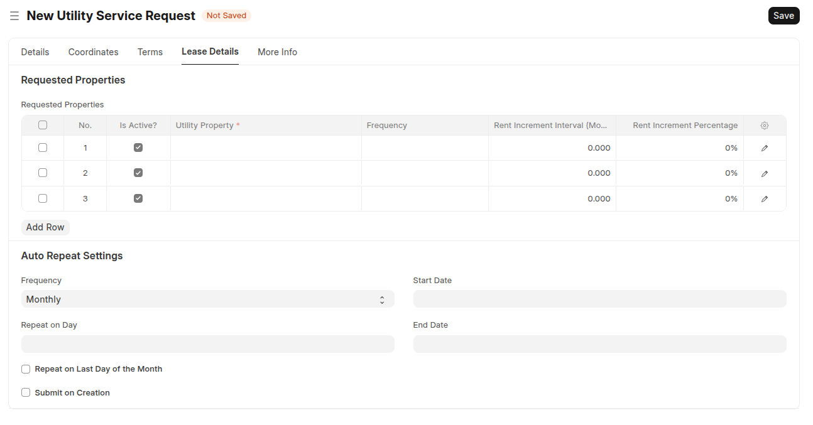
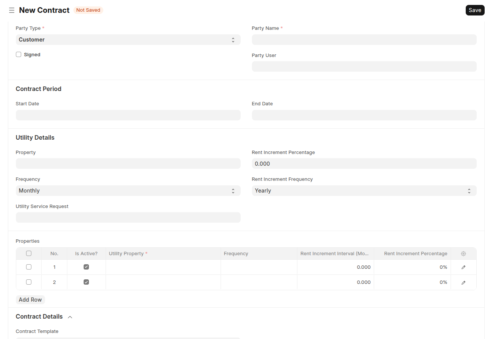

# 💡 **Utility Billing & Property Management for ERPNext**

## ⚙️ Integrated Utility Billing & Property Management System

The **Utility Billing & Property Management App** is a powerful addition to [ERPNext](https://erpnext.com), designed to streamline **utility billing**, **property leasing**, and **tenant management**. This module combines robust billing automation with advanced property oversight — ideal for municipal utilities, real estate managers, and property developers.

---

# I. 🔌 **Utility Billing**

---

### 🧩 **Main Functionalities**

### 🔌 **Utility Billing**

- 💬 Service Request Management
- 📏 Meter Reading
- 💰 Tariff Management
- 🧾 Bulk Billing (Mass Billing)

---

## 🔍 **Key Features**

---

### 🧾 **1. Utility Billing**

#### 🛠️ 1.1 Utility Billing Settings

Configure utility preferences in the **Utility Settings** doctype.


Key Fields:

- 🔄 **Sales Order / Invoice / Stock Entry Creation State** — Choose "Draft" or "Submitted"
- 📦 **Merge Sales Orders** — One invoice per customer across multiple orders

#### 👥 1.2 Customer Grouping

- Segment customers (e.g., Residential, Commercial) for tailored billing  
  🔗 [Customer Groups](https://docs.erpnext.com/docs/user/manual/en/customer-group)

#### 💲 1.3 Price Lists & Tariffs

- Define prices based on customer type, block rates, or service tiers  
  🔗 [Price Lists](https://docs.erpnext.com/docs/user/manual/en/price-lists)

---

### 📊 **2. Billing Management**

#### ⛽ 2.1 Meter Reading


Steps:

1. Select Customer
2. Add Utility Item & Enter Current Reading
3. System fetches previous reading & calculates usage
4. Auto creates Sales Order on Submit

#### 📝 2.2 Service Requests


Flow:

1. Add Request → Survey → BOM → Sales Order
2. New Meter Numbers may be assigned during request
3. Auto-create Customer profile & meter linkage

> 🖼️ 

> 🖼️   
> 🖼️ 

#### 🧮 2.3 Mass Billing


Steps:

1. Select Sales Orders
2. Menu → Create Sales Invoice
3. Background job auto-generates invoices

---

### 📌 **3. Important Notes**

#### 🔧 3.1 Item Configuration

- ✅ Tick "Is Utility Item" to mark billable services  
  

#### 📟 3.2 Meter Numbers

- Managed as **Serial Numbers**, assigned via **Warranty Claim**  
  

---

## 📊 **Visual Process Flows**

### 🔌 **Utility Service Request Process**



> 💡 Customer can be automatically created on submit, depending on configuration in settings. **Utility Billing Settings**.

---

### 🔌 **Utility Billing Workflow**



---

## 🧾 **Doctypes Summary**

### 📋 Utility Service Request

- Captures customer service needs, request type, and associated meters
- Includes survey, material BOM, and workflow logic

### 📏 Meter Reading

- Captures periodic consumption data for customers
- Auto-calculates bills from usage and tariffs

### ⚙️ Utility Billing Settings

- Central config for all automation and document generation behavior

---

### 🧾 Sales Order & Invoice Customization

- Tracks readings & rates via **custom child tables**
- Links tariff blocks per item for billing precision

---

# II. 🏢 **Property Management**

---

## 🧱 Overview

The **Property Management Module** in ERPNext provides a structured, end-to-end solution for managing rental properties — from onboarding tenants to recurring rent invoicing and utility billing.

It supports:

- 🏠 Property structuring (Project → Building → Unit)
- 📝 Service Requests to capture tenant intent
- 📄 Contract generation
- 💰 Deposit collection
- 🔁 Rent invoicing via Auto Repeat
- ⚡ Utility billing

> 🖼️ 

---

## 🏗️ Property Hierarchy

Properties are structured as:

```bash
Real Estate Project
 ├── Building A
 │    ├── Floor 1
 │    │    └── Unit 101
 │    ├── Floor 2
 │    │    └── Unit 201
 └── Building B
      └── Unit 301
```

Each unit is independently managed for contracts, billing, and utilities.

---

## 🔄 Workflow: From Service Request to Billing

### 🔌 **Utility Service Request Process**

> 💡 **Contract is optional but required based on _Utility Billing Settings_.**  
> 🧠 **Customer can be automatically created on submit**, depending on configuration in settings.



## 📂 Step-by-Step Functional Process

### 1️⃣ Utility Service Request (Initiation)

> 🖼️   
> 🖼️ 

Start by creating a **Utility Service Request**, which captures:

- 🧍 Tenant details (customer)
- 🏢 Desired unit(s)
- 📅 Contract dates and terms
- 💼 Lease duration

This acts as the **lead intake form** for tenants and is the **trigger point** for the rental flow.

---

### 2️⃣ Create Property Contract

> 🖼️ 

From an approved Service Request:

- Draft a **Property Contract**
- Define:
  - Contract period
  - Rental frequency (monthly, quarterly, yearly)
  - Rent escalation rules (optional)
  - Deposit terms
- Link:
  - Tenant (Customer)
  - Unit(s)

This contract governs all subsequent financial documents.

---

### 3️⃣ Generate Sales Order (Deposit / Booking)

> 🖼️ 

Directly from the service request:

- Create a **Sales Order** for:
  - 💰 Security deposit
  - 📌 Booking/advance payments
- Amounts auto-pulled from service request
- Tracks payment before lease start

---

### 4️⃣ Sales Invoice (Recurring Rent)

> 🖼️ 

Rent is billed based on the contract:

- 💼 Auto Repeat can auto-generate invoices
- Supports:
  - Monthly / Quarterly / Annual cycles
  - Rent escalation by %

---

### 5️⃣ Auto Repeat & Escalation

- 🔁 **Recurring Billing**: Set by contract
- 📈 **Escalation Rules**:
  - Custom % increase
  - Custom intervals
  - Manual override supported

---

## 💎 Strategic Benefits

✅ Captures tenant interest via **Utility Service Request**  
✅ Smooth transition to **Contracts**, **Sales Orders**, and **Invoices**  
✅ Centralized control of units, leases, and utilities  
✅ Seamless **rent + utility billing** under one customer  
✅ Enables workflows like **vacation notice**, **contract renewal**, or **meter change**

---

## 🛠️ **Installation (Self-Hosted)**

```bash
# Install Frappe Bench
https://github.com/frappe/bench

# Install ERPNext
https://github.com/frappe/erpnext
```

Clone this app into your apps folder and run:

```bash
bench get-app utility_billing [app_repo_url]
bench --site yoursite install-app utility_billing
```

---

## 📚 **Documentation & Support**

Need help? Browse detailed guides, FAQs, or open an issue in our GitHub repo.  
👉 [Documentation Link](https://github.com/navariltd/utility-billing)  
👉 [Community Forum](https://discuss.frappe.io)
