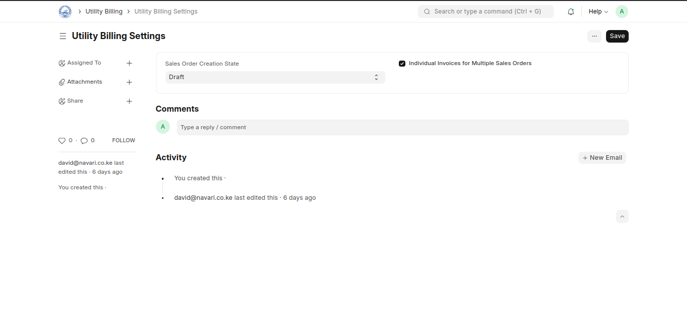
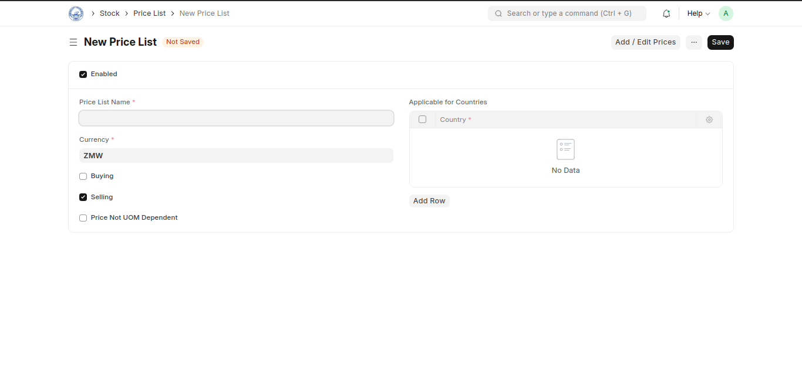
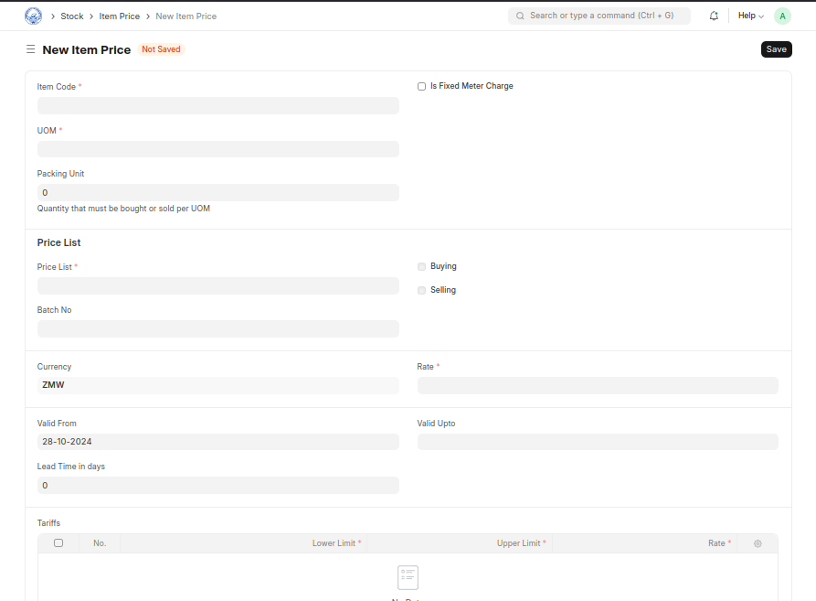
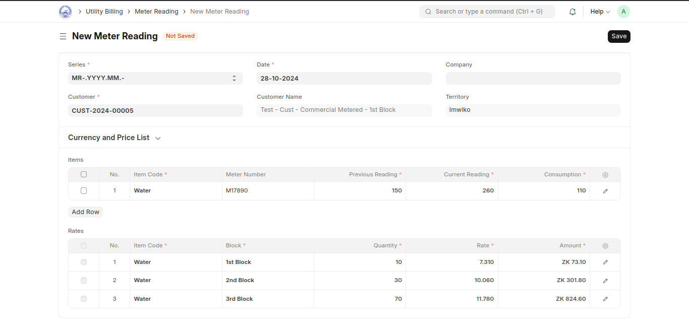
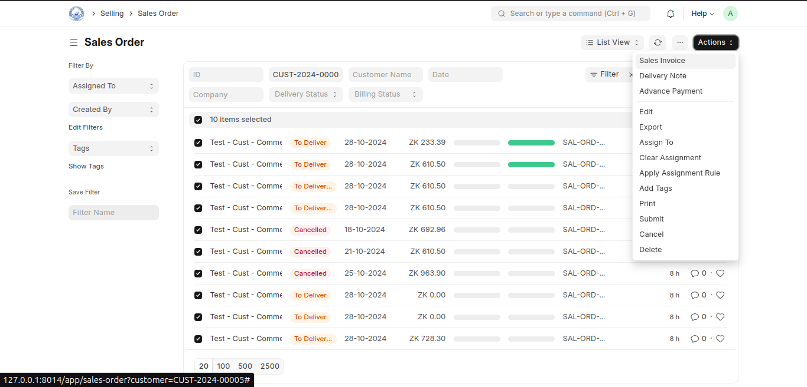
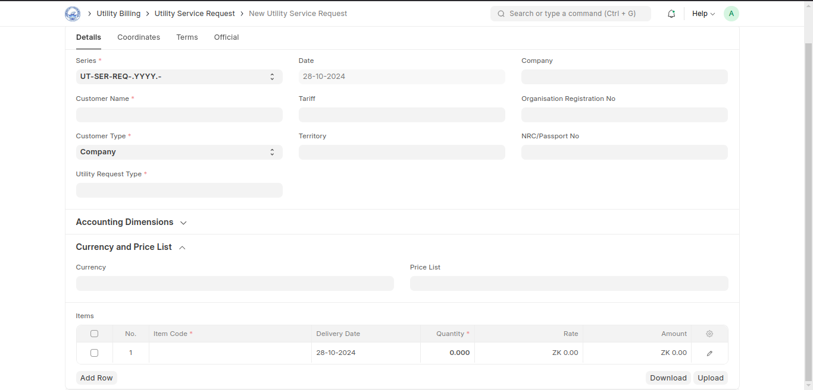

# <center>Utility Billing</center>

## <center> Utility Billing System Integration for ERPNext</center>

### Overview

The Utility Billing application provides a robust solution for managing utility billing processes within the [ERPNext](https://erpnext.com) framework. This integration streamlines the billing lifecycle for utilities such as water, electricity, and sanitation, ensuring accurate billing.

### Summary of Main Features:

1. **Service Request Management:**

   - Streamline handling of customer service requests related to utility issues, ensuring prompt responses and efficient resolutions.

2. **Meter Reading:**

   - Facilitate accurate meter reading processes for the collection and recording of consumption data, supporting billing accuracy and efficiency.

3. **Flexible Tariff Structures:**

   - Define and manage various tariff plans, allowing customization for different customer types and consumption levels to optimize billing accuracy.

4. **Bulk Billing:**
   - Enable bulk billing capabilities for processing multiple invoices at once, improving efficiency and reducing manual workload in the billing cycle.

## Key Features

### <a id="setup"></a> 1. Setup

I. **Utility Settings**
Go to the **Utility Settings** doctype to configure your utility provider details and settings.



II. **Customer Groups**:
Use **Customer Groups** to categorize customers, enabling specific tariff setups for each group.

III. **Price List and Item Prices**



- **Define Price List**: Create a price list associated with the relevant **Customer Group**, specifying the pricing strategy for different utility services.



- **Item Prices**: Within the **Item Prices** doctype, configure the tariffs captured in the tariffs table. This ensures that each **Customer Group** has tailored pricing based on consumption patterns and service types.

### <a id="billing_management"></a> 2. Billing Management

#### Meter Reading



Utilize the **Meter Reading** doctype to record periodic meter readings for each customer.

#### Mass Billing



Process bulk invoices efficiently using **Sales Orders**. Generate a single invoice for each unique customer, improving efficiency and reducing manual workload in the billing cycle.

## <a id="doctypes"></a> Doctypes

The Utility Billing application includes several key Doctypes essential for managing the utility billing process:

### Core Doctypes

### 1. **Utility Service Request**

- **Description**: Manages initial service requests for utilities, capturing essential details about the customer and type of service. It includes customer type, request type, and geographic identifiers like territory.
- **Key Fields**:
  - **Customer Name**: The full name of the customer initiating the service request.
  - **Customer Type**: The type of customer (Company, Individual, or Partnership).
  - **Request Type**: Specific type of utility service requested, linked to the service type.
  - **Date**: Date of the request, shown in list view and filters.
  - **Company**: Company handling the request.
  - **NRC/Passport No**: Unique ID for identification (NRC or Passport number).
  - **Tariff**: Rate group associated with the customer.
  - **Territory**: Customer's territory for service allocation.
  - **Utility Service Request Item**: Childtable to record the request services.



---

### 2. **Meter Reading**

- **Description**: Documents meter readings, linking them to utility requests and customer data. Supports periodic data capture for utility billing.
- **Key Fields**:
  - **Customer**: Reference to the customer account for which the meter reading is recorded.
  - **Date**: Reading date for data accuracy and billing cycle linkage.
  - **Price List**: Helps identify and calculate tariff rates.
  - **Meter Reading Item**: Childtable to record the meter readings.
  - **Rates**: Associated rates for this reading, drawn from applicable tariffs and meter reading items table.


---

### 3. **Utility Billing Settings**

- **Description**: Configures the default operational settings for the utility billing system, including invoice options and notification configurations.
- **Key Fields**:
  - **Sales Order Creation State**: Defines whether a sales order is in 'Draft' or 'Submitted' state by default.
  - **Individual Invoices for Multiple Sales Orders**: Checkbox setting for managing how invoices are generated per sales order.


### Manual/Self-Hosted Installation

1. [Install bench](https://github.com/frappe/bench)

2. [Install ERPNext](https://github.com/frappe/erpnext#installation)

3. Once bench and ERPNext are installed, add utility-billing to your bench by running:

```sh


$  bench  get-app  --branch  {branch-name}  https://github.com/navariltd/utility-billing.git

```

Replace `{branch-name}` with the desired branch name from the repository. Ensure compatibility with your installed versions of Frappe and ERPNext.

4. Install the utility-billing app on your site by running:

```sh

$  bench  --site  {sitename}  install-app  utility-billing

```

Replace `{sitename}` with the name of your site.

### Frappe Cloud Installation

- Sign up with Frappe Cloud.

- Setup a [bench](https://frappecloud.com/docs/benches/create-new).

- Create a new site.

- Choose Frappe Version-14/Version-15 or above, and select ERPNext, and Burundi Compliance from the available Apps to Install.

- Within minutes, the site will be up and running with a fresh install, ready to explore the app's simple and impressive features.

If assistance is needed to get started, reach out for consultation and support from: [Navari](https://navari.co.ke/).

### <center>License</center>

<center>GNU General Public License (v3). See [license.txt](https://github.com/navariltd/utility-billing/blob/master/license.txt) for more information.</center>
