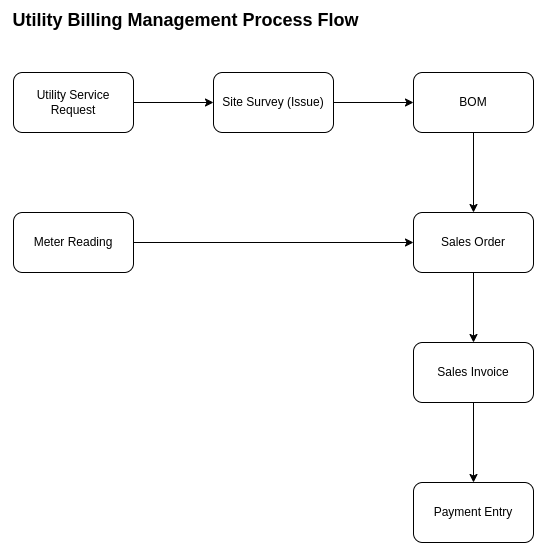
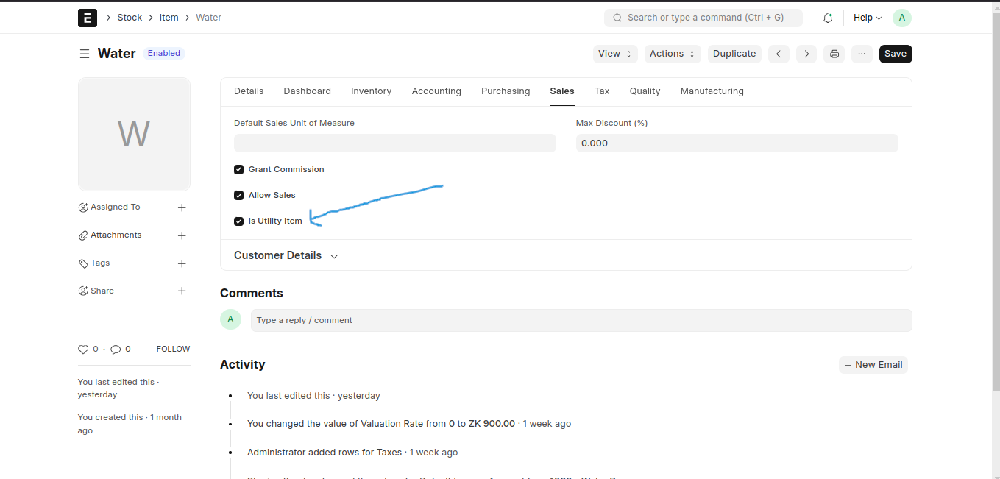
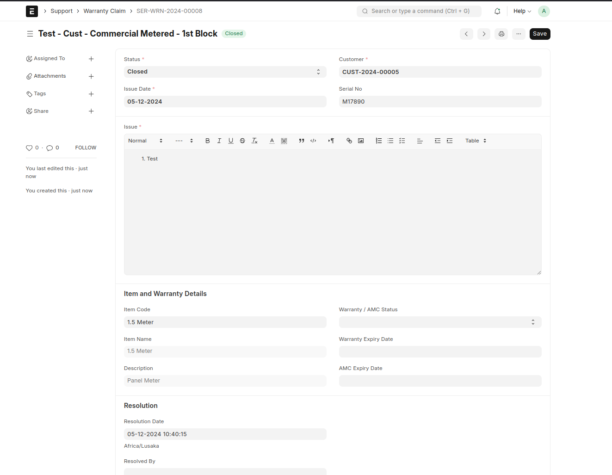
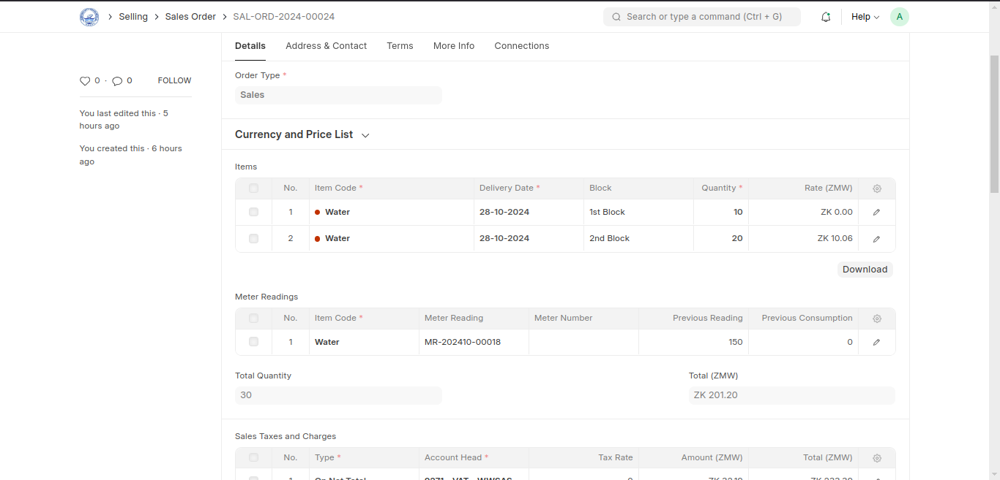
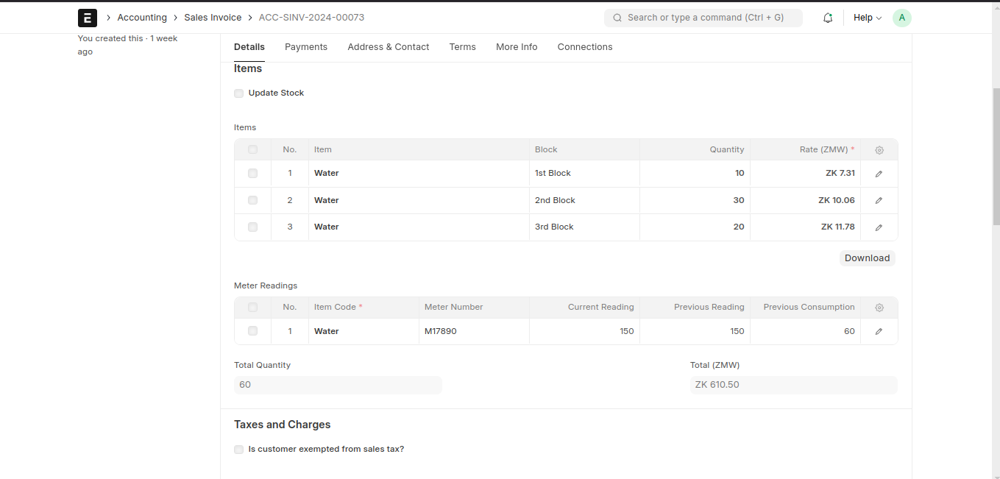

# **Utility Billing**  

## **Utility Billing System Integration for ERPNext**  

### **Overview**  

The Utility Billing application provides a robust solution for managing utility billing processes within the [ERPNext](https://erpnext.com) framework. This integration streamlines the billing lifecycle for utilities such as water, electricity, and sanitation, ensuring accurate billing.  
  

---

### **Summary of Main Features**  

1. **Service Request Management**  
   - Streamline handling of customer service requests related to utility issues, ensuring prompt responses and efficient resolutions.  

2. **Meter Reading**  
   - Facilitate accurate meter reading processes for the collection and recording of consumption data, supporting billing accuracy and efficiency.  

3. **Flexible Tariff Structures**  
   - Define and manage various tariff plans, allowing customization for different customer types and consumption levels to optimize billing accuracy.  

4. **Bulk Billing**  
   - Enable bulk billing capabilities for processing multiple invoices at once, improving efficiency and reducing manual workload in the billing cycle.  

---

## **Key Features**  

### 1. **Setup**  

#### **1.1 Utility Billing Settings**  
Go to the **Utility Settings** doctype to configure your utility provider details and settings.  

  

This section allows the configuration of operational preferences to streamline utility billing. Below are the key details and their functionalities:  
- **Sales Order Creation State**  
  - Defines the default state for new sales orders created through the utility billing module. The state can be set to "Draft" or "Submitted." Setting this to "Draft" allows for reviewing and verifying sales orders before final submission. Choosing "Submitted" directly generates submitted sales orders without additional review steps.  
- **Sales Invoice Creation State**  
  - Determines whether sales invoices generated are set to "Draft" or "Submitted" by default. Select "Draft" for an additional review process or "Submitted" for immediate invoicing.  
- **Stock Entry Creation State**  
  - Specifies the default state for stock entries created during utility billing-related transactions. Configurable to "Draft" or "Submitted."  
- **Create Single Invoice for Multiple Sales Orders per Customer**  
  - Consolidates multiple sales orders for a single customer into one invoice.  

#### **1.2 Customer Groups**  
- Categorize customers into groups like residential, commercial, or industrial. This categorization helps in applying tailored tariffs and services to different customer segments. To learn more about Customer Groups, visit [Customer Groups](https://docs.erpnext.com/docs/user/manual/en/customer-group).  

#### **1.3 Price List and Item Prices**  
- **Price List**: Create price lists specific to each customer group, detailing the rates for services like water usage, electricity consumption, or sewer charges. To learn more about Price Lists, visit [Price Lists](https://docs.erpnext.com/docs/user/manual/en/price-lists).  
- **Item Prices**: Use the "Item Prices" doctype to input detailed pricing, including block rates or fixed charges, for accurate billing. [Learn more about Item Prices here](https://docs.erpnext.com/docs/user/manual/en/item-price).  

  

---

### 2. **Billing Management**  

#### **2.1 Meter Reading**  
  

Meter Numbers are maintained as serial Numbers in ERPNext. To assign Meter Numbers to each customer, create a Warranty Claim. To learn more about Warranty Claim, [visit Warranty Claim here](https://docs.erpnext.com/docs/user/manual/en/warranty-claim).  

The Meter Reading doctype is used to log periodic meter readings for customers. To create a new Meter Reading:  
1. Go to Meter Reading List.  
2. Click "Add Meter Reading."  
3. Select the Customer.  
4. In the Items table, select the Utility Items and set the Current Readings.  
   - The previous reading will be pulled from the Customer’s previous Sales Invoice, and the Consumption is calculated using the formula:  
     **Consumption = (Current Reading - Previous Reading)**  
   - The Meter Number is fetched from the Customer’s associated Warranty Claim.  
5. Save and Submit.  

On saving, the consumption rates are auto-calculated based on the associated Item Price.  
On submitting, the system automatically creates a sales order for that customer, either in "Draft" or "Submitted" status, depending on the Utility Billing Settings.  

#### **2.2 Utility Service Request**  
  

Manage initial customer service requests efficiently. To create a new Utility Service Request:  
1. Go to Utility Service Request List.  
2. Click "Add Utility Service Request."  
3. Fill in the Customer (Requester) details.  
4. Select the Utility Request Type, e.g., New Connection.  
5. Tag the appropriate Cost Centers and Projects, if applicable.  
6. In the Items table, select the Utility Services requested.  
7. New Meter Numbers can also be assigned to the Customer at this stage by selecting a Metered Item and selecting the Meter Number.  
8. Save.  
9. Click on the "Create" button and select "Site Survey."  
   - A related issue to conduct a site survey is initialized here. The issue captures the findings of the site visit, ensuring all necessary conditions are met for the utility service. It must be in “Closed” or “Resolved” status to proceed.  
10. Click on the "Create" button and select "BOM."  
   - Generate a BOM for any required materials or equipment. Ensure all components needed for the request (e.g., meters, pipes) are listed. Submit the BOM to finalize resource allocation.  
11. Submit and create a Sales Order.  
   - On creating a Sales Order from the Utility Service Request, the Customer will be automatically created with their associated details, including Meter Number assignment, if any exists.  

#### **2.3 Mass Billing**  
  

Streamlines the billing process by generating a single invoice from multiple customers’ sales orders.  
1. Go to Sales Order List.  
2. Select the specific Sales Orders.  
3. Click on the "Menu," then click on "Sales Invoice."  
4. A background job will run to generate the invoices.  

---

### 3. **NOTE**  

#### **3.1 Item Configuration**  
- Ensure that the "Is Utility Item" checkbox is ticked to clearly identify items that pertain to utility services.  
  

#### **3.2 Meter Numbers**  
- Maintain meter numbers as serial numbers in ERPNext. Assign them via Warranty Claims for seamless integration.  
  

---

## **Doctypes**  


### Core Doctypes

### 1. **Utility Service Request**

- **Description**: Manages initial service requests for utilities, capturing essential details about the customer and type of service. It includes customer type, request type, and geographic identifiers like territory.
- **Key Fields**:
  - **Customer Name**: The full name of the customer initiating the service request.
  - **Customer Type**: The type of customer (Company, Individual, or Partnership).
  - **Request Type**: Specific type of utility service requested, linked to the service type.
  - **Date**: Date of the request, shown in list view and filters.
  - **Company**: Company handling the request.
  - **NRC/Passport No**: Unique ID for identification (NRC or Passport number).
  - **Tariff**: Rate group associated with the customer.
  - **Territory**: Customer's territory for service allocation.
  - **Utility Service Request Item**: Childtable to record the request services.


---

### 2. **Meter Reading**

- **Description**: Documents meter readings, linking them to utility requests and customer data. Supports periodic data capture for utility billing.
- **Key Fields**:
  - **Customer**: Reference to the customer account for which the meter reading is recorded.
  - **Date**: Reading date for data accuracy and billing cycle linkage.
  - **Price List**: Helps identify and calculate tariff rates.
  - **Meter Reading Item**: Childtable to record the meter readings.
  - **Rates**: Associated rates for this reading, drawn from applicable tariffs and meter reading items table.


---

### 3. **Utility Billing Settings**

- **Description**: Configures the default operational settings for the utility billing system, including invoice options and notification configurations.
- **Key Fields**:
  - **Sales Order Creation State**: Defines whether a sales order is in 'Draft' or 'Submitted' state by default.
  - **Individual Invoices for Multiple Sales Orders**: Checkbox setting for managing how invoices are generated per sales order.


### Customizations

### **1. Sales Order & Sales Invoice**

- Rates (Sales Order Meter Reading & Sales Invoice Meter Reading) child tables to track and calculate charges based on the meter readings associated with each sales order.
- Block field to link each item in the items child tables to a specific tariff block.




### **2. Item**

- Is Utility Item (is_utility_item) to identify items that should be processed as utility-related.


### **3. Item Price**
- Tariff table - This table allows defining blocks with upper and lower limits and corresponding rates. It helps distribute rates based on consumption levels, ensuring accurate billing according to predefined tariff structures.


### Manual/Self-Hosted Installation

1. [Install bench](https://github.com/frappe/bench)

2. [Install ERPNext](https://github.com/frappe/erpnext#installation)

3. Once bench and ERPNext are installed, add utility-billing to your bench by running:

```sh


$  bench  get-app  --branch  {branch-name}  https://github.com/navariltd/utility-billing.git

```

Replace `{branch-name}` with the desired branch name from the repository. Ensure compatibility with your installed versions of Frappe and ERPNext.

4. Install the utility-billing app on your site by running:

```sh

$  bench  --site  {sitename}  install-app  utility_billing

```

Replace `{sitename}` with the name of your site.

### Frappe Cloud Installation

- Sign up with Frappe Cloud.

- Setup a [bench](https://frappecloud.com/docs/benches/create-new).

- Create a new site.

- Choose Frappe Version-14/Version-15 or above, and select ERPNext, and Burundi Compliance from the available Apps to Install.

- Within minutes, the site will be up and running with a fresh install, ready to explore the app's simple and impressive features.

If assistance is needed to get started, reach out for consultation and support from: [Navari](https://navari.co.ke/).

### <center>License</center>

<center>GNU General Public License (v3). See [license.txt](https://github.com/navariltd/utility-billing/blob/master/license.txt) for more information.</center>
