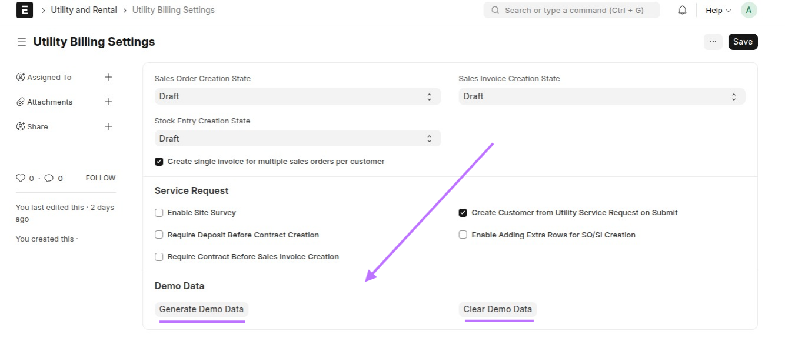
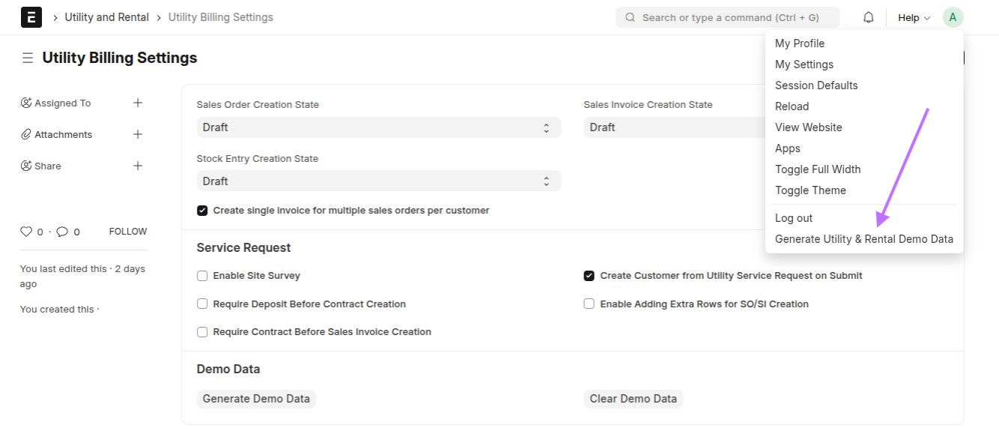

# � Demo Data Generation for Utility Billing

## Overview

To help you **quickly test and explore** the features of the Utility Billing & Property Management app, we provide a powerful **Demo Data Generation** feature. This tool populates your system with realistic sample data — including customers, properties, tenants, service requests, and billing records — without impacting your live production environment.

> ⚠️ **Intended for Development or Staging Only**
> Avoid using this feature in a production environment, as it will introduce sample records into your live database.

---

## 🎯 What Gets Created?

- Sample Customers & Items
- Utility Properties
- Service Requests
- Contracts
- Utility Stuctures
- Pricing Records (Item Prices and Price Lists)
- Meters and Meter Readings
- Sales Orders & Invoices

This gives you a **fully functional demo setup** for showcasing or testing workflows from end to end.

---

## ⚙️ How to Generate Demo Data

#### 🎥 Video:

<video src="./video/demo-data.mp4" width="600" controls>
  Your browser does not support the video tag.
</video>

### Option 1: From Utility Billing Settings

You can generate demo data directly from the **Utility Billing Settings** page.

---

### Option 2: From Toolbar (Quick Action)

You can also generate demo data from the **Toolbar**

---

## � Clearing Demo Data

Need to reset your environment? Use the **Clear Demo Data** option to safely remove all generated records.

> Available from the same locations (Settings or Toolbar)

---

## ❗ Important Notes

- **Non-destructive to real data:** It does not touch your manually entered records.
- **Safe rollback with full removal** via the Clear Demo Data option.
- **Great for demo, training, and staging use.**

---

## 🚀 Quick Navigation

