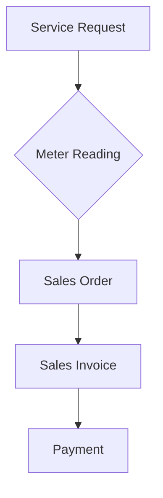

# ⛽ Meter Reading Doctype

The **Meter Reading** doctype is a core component of the [Utility Billing](https://github.com/navariltd/utility-billing) app for ERPNext. It allows service providers to efficiently track and bill customers based on utility consumption such as water, electricity, or gas.

It captures utility usage for a given customer and automatically generates a **Sales Order** based on the usage and applicable tariffs. This reduces manual data entry and automates billing.

## 📋 Workflow

## ✅ Steps to Use

1. **Select Customer**
2. **Add Utility Item(s)** and enter the **Current Reading**
3. System calculates usage (Current - Previous Reading)
4. On **Submit**, the system auto-generates a **Sales Order**

## 🧱 Doctype Structure

| Field                                 | Type                       | Description                                     |
| ------------------------------------- | -------------------------- | ----------------------------------------------- |
| `Customer`                            | Link                       | Linked to Customer master                       |
| `Date`                                | Date                       | Date of meter reading                           |
| `Property`                            | Link                       | Auto-fetched from customer                      |
| `Currency` / `Price List`             | Link                       | Billing currency and applicable price list      |
| `Items`                               | Table (Meter Reading Item) | Enter previous and current readings per utility |
| `Rates`                               | Table (Read-Only)          | Auto-fetched tariff rates for preview           |
| `Company` / `Cost Center` / `Project` | Link                       | Accounting and cost tracking fields             |

---

## 📦 Related Child Doctypes

- **Meter Reading Item**
  Captures individual utility item readings.

  - `Utility Item` (e.g., Water, Electricity)
  - `Previous Reading`
  - `Current Reading`
  - `Usage` (auto-calculated)

- **Meter Reading Tariff Rate**
  Linked to tariff configurations that determine the charge per unit used.

## ⚙️ Automation on Submit

When a **Meter Reading** is submitted:

- Usage is calculated per item.
- Tariffs are applied to compute billable amounts.
- A **Sales Order** is automatically created.

## 🚀 Quick Navigation

