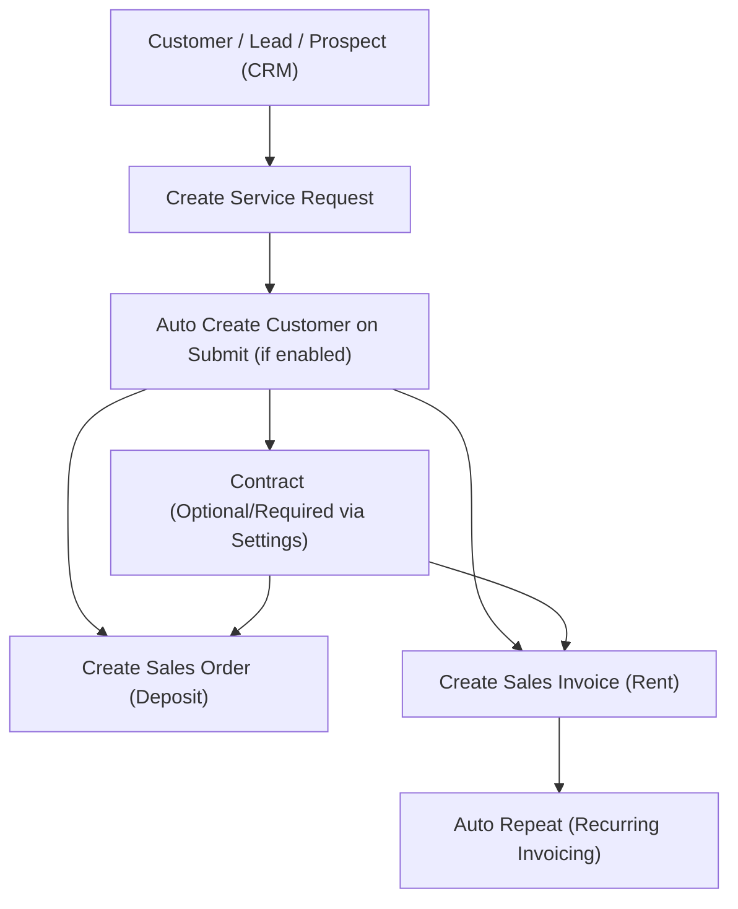

# II. 🏢 **Property Management**

---

## 🧱 Overview

The **Property Management Module** in ERPNext provides a structured, end-to-end solution for managing rental properties — from onboarding tenants to recurring rent invoicing and utility billing.

It supports:

- 🏠 Property structuring (Project → Building → Unit)
- 📝 Service Requests to capture tenant intent
- 📄 Contract generation
- 💰 Deposit collection
- 🔁 Rent invoicing via Auto Repeat
- ⚡ Utility billing


---

## 🏗️ Property Hierarchy

Properties are structured as:

```bash
Real Estate Project
 ├── Building A
 │    ├── Floor 1
 │    │    └── Unit 101
 │    ├── Floor 2
 │    │    └── Unit 201
 └── Building B
      └── Unit 301
```

Each unit is independently managed for contracts, billing, and utilities.

---

## 🔄 Workflow: From Service Request to Billing

### 🔌 **Utility Service Request Process**

> 💡 **Contract is optional but required based on _Utility Billing Settings_.**  
> 🧠 **Customer can be automatically created on submit**, depending on configuration in settings.



## 📂 Step-by-Step Functional Process

### 1️⃣ Utility Service Request (Initiation)

  


Start by creating a **Utility Service Request**, which captures:

- 🧍 Tenant details (customer)
- 🏢 Desired unit(s)
- 📅 Contract dates and terms
- 💼 Lease duration

This acts as the **lead intake form** for tenants and is the **trigger point** for the rental flow.

---

### 2️⃣ Create Property Contract


From an approved Service Request:

- Draft a **Property Contract**
- Define:
  - Contract period
  - Rental frequency (monthly, quarterly, yearly)
  - Rent escalation rules (optional)
  - Deposit terms
- Link:
  - Tenant (Customer)
  - Unit(s)

This contract governs all subsequent financial documents.

---

### 3️⃣ Generate Sales Order (Deposit / Booking)


Directly from the service request:

- Create a **Sales Order** for:
  - 💰 Security deposit
  - 📌 Booking/advance payments
- Amounts auto-pulled from service request
- Tracks payment before lease start

---

### 4️⃣ Sales Invoice (Recurring Rent)


Rent is billed based on the contract:

- 💼 Auto Repeat can auto-generate invoices
- Supports:
  - Monthly / Quarterly / Annual cycles
  - Rent escalation by %

---

### 5️⃣ Auto Repeat & Escalation

- 🔁 **Recurring Billing**: Set by contract
- 📈 **Escalation Rules**:
  - Custom % increase
  - Custom intervals
  - Manual override supported

---

## 💎 Strategic Benefits

✅ Captures tenant interest via **Utility Service Request**  
✅ Smooth transition to **Contracts**, **Sales Orders**, and **Invoices**  
✅ Centralized control of units, leases, and utilities  
✅ Seamless **rent + utility billing** under one customer  
✅ Enables workflows like **vacation notice**, **contract renewal**, or **meter change**

---

## 🚀 Quick Navigation

[](https://github.com/navariltd/utility-billing)
[](https://github.com/navariltd/utility-billing/wiki)
[](https://docs.erpnext.com)
[](https://frappeframework.com/docs)
[](https://discuss.frappe.io)
[](https://github.com/navariltd/utility-billing/issues)
[](https://navari.co.ke)
