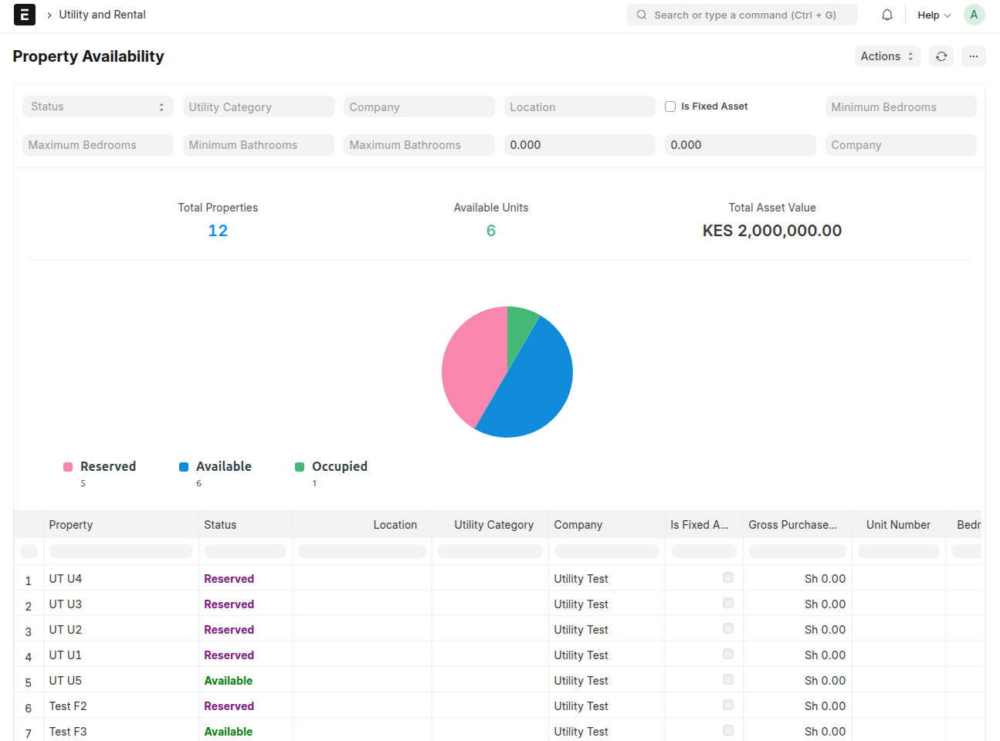
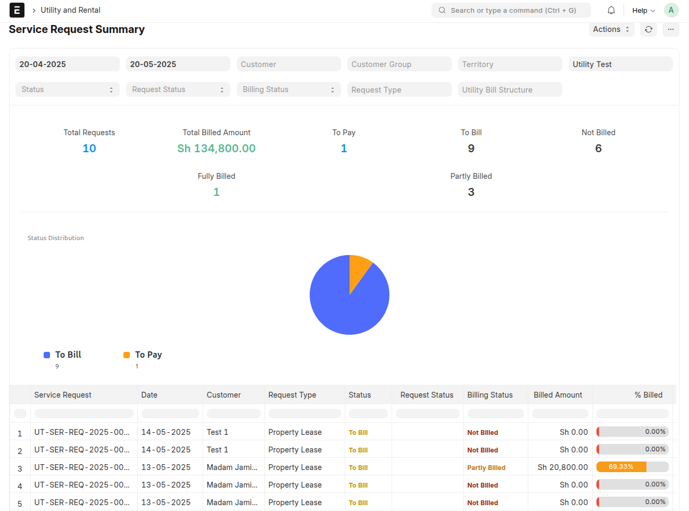
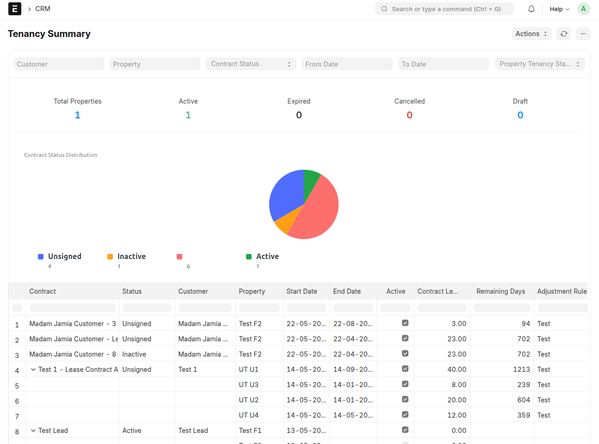
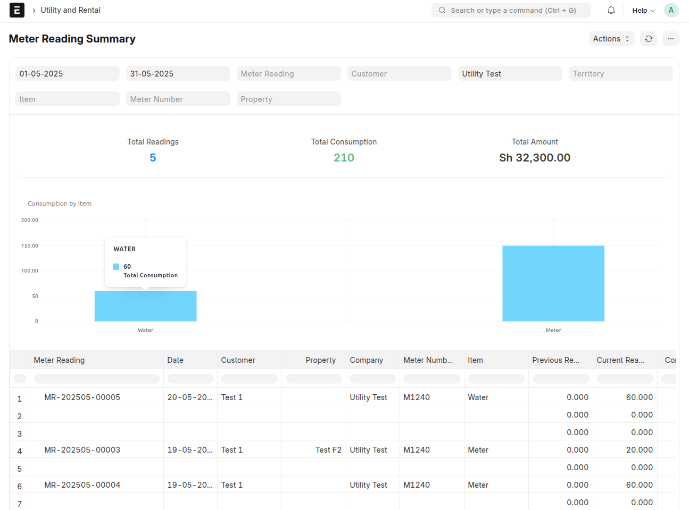

## 📊 Reports

### 🏢 Property Availability Report

> Track real-time property inventory with occupancy status, unit specifications (bedrooms, bathrooms, size), and total asset value across your portfolio. Visualize vacancy rates and property distribution.

### 🛠️ Service Request Summary

> Monitor the complete lifecycle of service requests from initiation to billing. Analyze request types, completion statuses, and associated billing progress across different customer segments.

### 📝 Tenancy Summary Report

> Manage lease contracts with visibility on active/expired agreements, remaining lease durations, and property assignments. Track contract adjustments and insurance coverage status.

### 🔌 Meter Reading Summary

> Analyze utility consumption patterns with detailed meter reading comparisons. View consumption by item type, tariff block rates, and generated billing amounts for accurate utility cost tracking.

## 🚀 Quick Navigation

