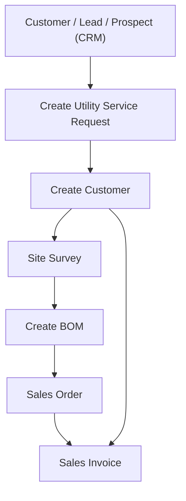

## ⚙️ Utility Service Request Overview

The **Utility Service Request (USR)** Doctype is the core intake and workflow document for managing both property leasing and utility connections. It handles everything from customer onboarding to contract creation and utility billing setup.

## 

---

## 🌟 Key Use Cases

### 🏘 Property Management

- Tenant lead intake
- Property/Unit selection
- Lease creation and management
- Booking & deposit payments
- Automated rent billing and escalation

### 💧 Utility Billing

- Request for water/electricity/sewerage connection
- Meter assignment and tracking
- Utility structure mapping
- Automated recurring utility billing
- Billing status monitoring

---

## 🧩 Features & Fields Explained

### 🔑 Core Information

- **Request Type** (`request_type`): Define the type of utility request (e.g. new connection, disconnection, upgrade).
- **Service Request From**: Specify source (Customer, Lead, Prospect).
- **Party Name / Customer Name**: Link to CRM or new customer entry.
- **NRC/Passport No.**: Identify the customer or tenant.

---

### 🧾 Items Table

Each Utility Service Request can include multiple items tied to the contract, enabling automatic population of sales documents and dynamic utility billing. These items could represent:

- One-time fees (e.g., connection fee, inspection)
- Recurring services (e.g., monthly rent, water charge, electricity base fee)

> 📌 This table ensures **Sales Orders** and **Invoices** are pre-filled based on service definitions in the Utility Service Request.

---

### 🧩 Utility Bill Structure Link

The **Utility Bill Structure** provides a reusable billing configuration template that includes default items and rules for generating bills.

> Link the **Utility Bill Structure** to the Utility Service Request to auto-populate item rows and configure billing behavior.

## 

### 🧾 Contract & Billing

- **Contract Dates (start_date, end_date)**: Define service period.
- **Price List / Currency**: For dynamic pricing.

## 

---

### 🧮 Financials & Project Dimensions

- **Cost Center & Project**: For accounting and project tracking.
- **Sales Order & Invoice Generation**: Generate deposit or booking orders and recurring invoices directly from the request.

---

### 🧰 Location/Network Info (Utility-Specific)

- **Connection Size**: Define pipe or cable size.
- **Pipe Distance / Type**: Record distance to water/sewer network.
- **Water Network / Location**: Specify connection point.

service_request_coord_tab.png

---

### 🏠 Requested Properties

This section allows you to assign and manage multiple utility or rental properties within a single service request. Each property item supports advanced billing and automation features designed to streamline lease and invoice generation processes.

- 🔗 **Utility Property**: Link a specific property to this contract or service request.
- 🏷️ **Is Active?**: Enable or disable this item from billing or invoicing actions.

#### 📈 Billing Increment Settings

Use these settings to configure automatic rent or service charge increases over time:

- **Increment Frequency**: Set how often the increment should be applied (e.g., Monthly, Quarterly, Yearly).
- **Increment Interval (Months)**: Define the number of months between each increment (e.g., `12` for yearly, `6` for semi-annual).
- **Increment Percentage**: The percentage by which the amount increases at each interval. For example, enter `5` to increase by 5% each cycle.

These settings ensure your contracts remain inflation-adjusted or aligned with periodic rate revisions.

#### 🔁 Recurring Billing Schedule

This section mimics the behavior of the **Auto Repeat** feature used in ERPNext:

- **Frequency**: Choose how often to generate recurring invoices (e.g., Monthly, Quarterly).
- **Repeat on Day**: For monthly/quarterly frequencies, specify the exact day (e.g., 5 for the 5th of each month).
- **Repeat on Last Day of the Month**: Automatically sets recurrence to the last day regardless of the month's length.
- **Submit on Creation**: Automatically submits the generated document on creation—useful for billing workflows.

Together, these fields enable automated invoice generation based on the contract terms defined in each property row, allowing for hands-free recurring billing that aligns with lease or utility agreements.

#### 📅 Date Constraints

- **Start Date / End Date**: Defines the period during which the utility contract or billing should remain active for that property. These dates are validated against the main request to ensure consistency.

---

_Lease settings overview for managing multiple properties in a single contract._

_Each property row includes settings for auto-repeat and billing increments._

---

### 📬 Address & Contact

- Embedded address and contact display tabs for easy CRM integration.

---

## 🔄 Flow: Property Rental + Utility Connection

---

## 🚀 Process Breakdown

### 1️⃣ Create Utility Service Request

- Initiated from CRM (Lead/Customer)
- Captures all necessary details (tenant, property, utility needs)

### 2️⃣ Site Survey & BOM

- On approval, site survey & BOM document created
- Captures technical and engineering details of connection

### 3️⃣ Contract & Meter Linkage

- Auto-creates **Property Contract** for property leasing
- Assigns **Meter Numbers** for utilities (auto-generated or manually linked)
- Creates **Customer → Meter linkage**

### 4️⃣ Generate Sales Order

- Deposit or booking amount auto-fetched from USR
- Sales Order submitted for payment processing

### 5️⃣ Sales Invoice & Auto Repeat

- Generates first invoice
- Sets up automatic billing for rent or utility usage
- Escalation rules applied where needed

## 🚀 Quick Navigation

