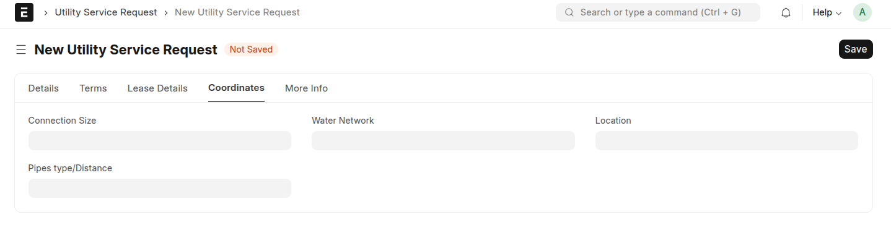
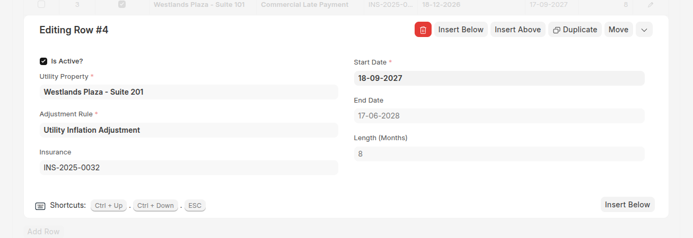
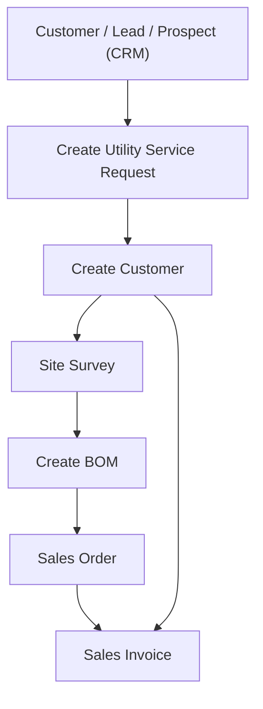

## ⚙️ Utility Service Request Overview

The **Utility Service Request (USR)** Doctype is the core intake and workflow document for managing both property leasing and utility connections. It handles everything from customer onboarding to contract creation and utility billing setup.

## 

---

## 🌟 Key Use Cases

### 🏘 Property Management

- Tenant lead intake
- Property/Unit selection
- Lease creation and management
- Booking & deposit payments
- Automated rent billing and escalation

### 💧 Utility Billing

- Request for water/electricity/sewerage connection
- Meter assignment and tracking
- Utility structure mapping
- Automated recurring utility billing
- Billing status monitoring

---

## 🧩 Features & Fields Explained

### 🔑 Core Information

- **Request Type** (`request_type`): Define the type of utility request (e.g. new connection, disconnection, upgrade).
- **Service Request From**: Specify source (Customer, Lead, Prospect).
- **Party Name / Customer Name**: Link to CRM or new customer entry.
- **NRC/Passport No.**: Identify the customer or tenant.

---

### 🧾 Items Table

Each Utility Service Request can include multiple items tied to the contract, enabling automatic population of sales documents and dynamic utility billing. These items could represent:

- One-time fees (e.g., connection fee, inspection)
- Recurring services (e.g., monthly rent, water charge, electricity base fee)

> 📌 This table ensures **Sales Orders** and **Invoices** are pre-filled based on service definitions in the Utility Service Request.

---

### 🧩 Utility Bill Structure Link

The **Utility Bill Structure** provides a reusable billing configuration template that includes default items and rules for generating bills.

> Link the **Utility Bill Structure** to the Utility Service Request to auto-populate item rows and configure billing behavior.

## 

### 🧾 Contract & Billing

- **Contract Dates (start_date, end_date)**: Define service period.
- **Price List / Currency**: For dynamic pricing.

## 

---

### 🧮 Financials & Project Dimensions

- **Cost Center & Project**: For accounting and project tracking.
- **Sales Order & Invoice Generation**: Generate deposit or booking orders and recurring invoices directly from the request.

---

### 🧰 Location/Network Info (Utility-Specific)

- **Connection Size**: Define pipe or cable size.
- **Pipe Distance / Type**: Record distance to water/sewer network.
- **Water Network / Location**: Specify connection point.

service_request_coord_tab.png

---

### 🏠 Requested Properties

This section allows you to assign and manage multiple utility or rental properties within a single service request. Each property item supports advanced billing and automation features designed to streamline lease and invoice generation processes.

- #### 🏘️ **Utility Property**

  A required field that links to the specific property associated with this contract item.

- #### ✅ **Is Active?**

  Indicates whether the property is currently active for billing. Uncheck to temporarily disable invoicing or adjustments for the item.

- #### 📅 **Start Date / End Date**

  Defines the contract duration for the property. Billing and adjustments are only applied within this date range.

- #### 📐 **Contract Length (Months)**

  Automatically calculated or manually defined, this represents the total duration of the contract in months. Useful for internal reporting or rule application.

- #### 🛡️ **Insurance**

  Links to an Insurance document that provides coverage details for the property during the rental period.

- #### ⚙️ **Adjustment Rule**

  Links to a `Billing Adjustment Rule`, which determines how rates change over time (e.g., percentage-based rent increments or conditional adjustments).

---

### 📬 Address & Contact

- Embedded address and contact display tabs for easy CRM integration.

---

## 🔄 Flow: Property Rental + Utility Connection

---

## 🚀 Process Breakdown

### 1️⃣ Create Utility Service Request

- Initiated from CRM (Lead/Customer)
- Captures all necessary details (tenant, property, utility needs)

### 2️⃣ Site Survey & BOM

- On approval, site survey & BOM document created
- Captures technical and engineering details of connection

### 3️⃣ Contract & Meter Linkage

- Auto-creates **Property Contract** for property leasing
- Assigns **Meter Numbers** for utilities (auto-generated or manually linked)
- Creates **Customer → Meter linkage**

### 4️⃣ Generate Sales Order

- Deposit or booking amount auto-fetched from USR
- Sales Order submitted for payment processing
- Auto repeat can be optionally configured for recurring orders

When **Rent Billing Approach** is **Item Price**, **Create → Sales Order /
Deposit** skips the modal and opens the standard **new Sales Order form**
instead, pre-filled with the customer, the service request, the company, the
dates and the price list. The document is completed and saved on its own form.

### 5️⃣ Sales Invoice & Payment

- Generates first invoice
- Optional automatic billing setup for rent or utility usage
- Escalation rules applied where needed

As with the Sales Order, when **Rent Billing Approach** is **Item Price**,
**Create → Sales Invoice** opens the standard **new Sales Invoice form**
pre-filled from the request.

### 5️⃣ Property Items Are Added Automatically

Adding a row to **Requested Properties** brings in that property's rent item
for you — there is no need to add it by hand:

- Every requested property's **service item** (named after the property) is
  fetched and appended to the **Items** table.
- Removing a property removes its item row, so the two tables stay in step.
- Re-adding a property does not create a duplicate row.
- Items you add by hand are left untouched; only property rows are managed.
- The **Items** table is optional: a request can be saved without any items and
  they can be added later, on the request or on the Sales Order / Sales Invoice
  built from it. When a **Utility Bill Structure** is set, its items still
  populate the table automatically.
- The item carries its name, UOM, rate and description. The rate comes from
  the document's **Price List** when one is set, otherwise the item's standard
  rate.
- Changing the **Price List** re-resolves the property item rates.

The **Price List** defaults from the customer (or the customer group) when the
document does not already have one, so rates resolve without extra steps.

### 6️⃣ Define Item Prices (Item Price Billing)

When **Utility Billing Settings → Rent Billing Approach** is set to **Item
Price**, use **Define → Item Prices** on the service request to generate the
rent rates for the whole lease instead of an Auto Repeat.

- Select the property and enter the **Base Rate** per property.
- Pick the lease period and a **Billing Adjustment Rule** (for example 5% per
  year) to auto-calculate the rates for every period.
- Add **Manual Rates** to override a generated rate from a specific date.
- **Preview** expands the periods, and **Create Item Prices** writes one
  **Item Price** per property, period and customer using the property's
  service item.
- Re-running the action skips periods that are already priced, so it never
  duplicates rates.

The generated schedule is stored on the read-only **Item Price Schedule**
table of the request. See
[Rent Billing by Item Price](./Rent-Billing-by-Item-Price.md) for details.

## 🚀 Quick Navigation

