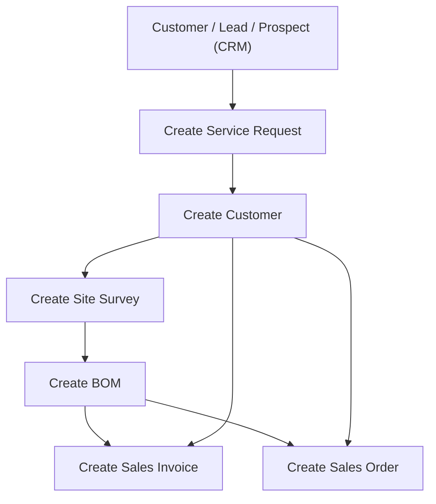
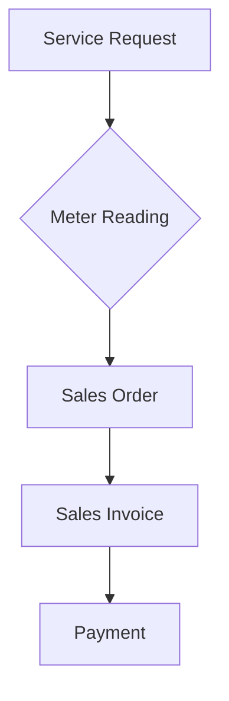

# I. 🔌 **Utility Billing Overview**

### 🧩 Main Functionalities

- 💬 Service Request Management
- 📏 Meter Reading
- 💰 Tariff Management
- 🧾 Bulk Billing (Mass Billing)

## 🔍 Key Modules & Features

### 🧾 1. **Utility Billing Setup**

#### 🛠️ 1.1 Utility Billing Settings

Configure preferences in the **Utility Settings** doctype.

**Key Fields:**

- 🔄 **Sales Order / Invoice / Stock Entry Creation State** — Choose between "Draft" or "Submitted"
- 📦 **Merge Sales Orders** — One invoice per customer across multiple orders

#### 👥 1.2 Customer Grouping

Segment customers for tailored billing (e.g., Residential, Commercial).

#### 💲 1.3 Price Lists & Tariffs

Define rates based on customer type, block rates, or service tiers.

### 📊 2. **Billing Operations**

#### 📝 2.1 Service Requests

Flow:

1. Add Request → Survey → BOM → Sales Order
2. Assign new Meter Numbers
3. Auto-create Customer & Meter Linkage

#### ⛽ 2.2 Meter Reading

Steps:

1. Select Customer
2. Add Utility Item & Enter Current Reading
3. System auto-calculates usage
4. Sales Order is generated on Submit

#### 🧮 2.3 Mass Billing

Steps:

1. Select multiple Sales Orders
2. Use Menu → "Create Sales Invoice"
3. Background job auto-generates invoices

### 📌 3. Important Notes

#### 🔧 3.1 Item Configuration

✅ Tick "Is Utility Item" to mark billable services.

#### 📟 3.2 Meter Numbers

Managed as **Serial Numbers**, assigned via **Warranty Claim**.

#### 📟 3.3 Sales Order and Sales Invoice Customizations

The **Sales Order** and **Sales Invoice** Doctypes in ERPNext have been customized to incorporate new fields and sections related to utility billing, meter readings, and service requests

## 🚀 Quick Navigation

